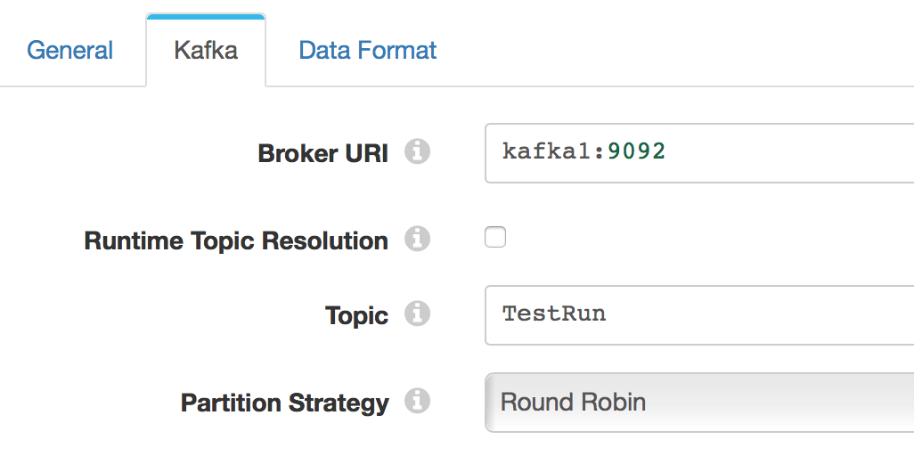
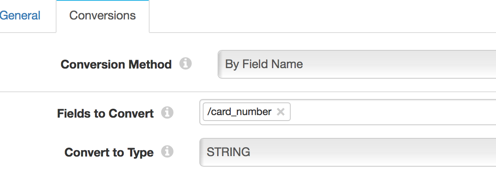
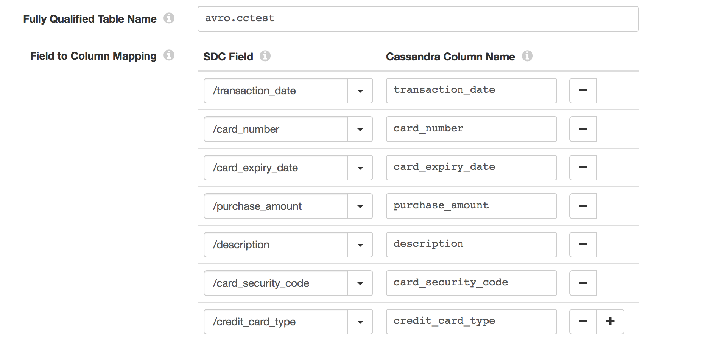

# DataStax with Streamsets
Purpose of this project is to serve as an example for how to implement DataStax and Streamsets using docker images provided by DataStax, streamsets and open source Kafka.

Four docker images  are used:   
DataStax Server, Kafka, zookeeper, and Streamsets data collector.   

The DataStax images are well documented at this github location  [https://github.com/datastax/docker-images/]()

Creating custom Kafka producers and consumers can be an arduous process that requires manual coding. In this tutorial, a StreamSets Data Collector is used to create data ingest pipelines to write to Kafka using a Kafka Producer.  Then, a separate StreamSets pipeline reads from Kafka with a Kafka Consumer and writes to Cassandra with no handwritten code.  This Kafka consumer performs conversions of the data before writing the data to Cassandra.


Data will come from this Sample Data
 [https://github.com/streamsets/tutorials/blob/master/sample_data/](sample_data)


## Getting Started
1. Prepare Docker environment
2. Pull this github into a directory  
```git clone https://github.com/jphaugla/datastaxStreamsetsDocker.git
```
3. Follow notes from DataStax Docker github to pull the needed DataStax images.  Directions are here:  [https://github.com/datastax/docker-images/#datastax-platform-overview]().  Don't get too bogged down here.  The pull command is provided with this github in pull.sh. It is requried to have the docker login and subscription complete before running the pull.  The included docker-compose.yaml handles most everything else.
4. Open terminal, then: `docker-compose up -d`
5. Verify DataStax is working for the DataStax hosts:
```
docker exec dse cqlsh -u cassandra -p cassandra -e "desc keyspaces";
```
6. Add avro tables and keyspace for later DSE Search testing:
```
docker cp src/create_table.cql dse:/opt/dse
docker exec dse cqlsh -f /opt/dse/create_table.cql
```

## Streamsets Pipelines

As an alternative to creating these pipelines, the pipelines are exported in the exports directory.  This will be shown as a "shortcut" option.

Streamsets pipeline documentation can be found here:

https://streamsets.com/documentation/datacollector/latest/help/#datacollector/UserGuide/Pipeline_Design/What_isa_Pipeline.html

A pipeline describes the flow of data from the origin system to destination systems and defines how to transform the data along the way.

We will have a pipeline to pull data from an avro file and add it to kafka.  Then, a second pipeline will pull data from kafka and write to DataStax Cassandra

## Create Kafka producer pipeline

When completed, the pipeline will look like this:


### Creating a Pipeline
1. Bring up the Streamsets Data Collector from the browser with localhost:18630
2. Create a new Pipeline by clicking the **Create New Pipeline** button to bring up the New Pipeline dialog box.  Enter a Title and Description for the Pipeline and click **Save**.


#### Defining the Source

* Drag the **Directory** origin stage into your canvas.
* In the Configuration settings below, select the *Files* tab.

* Enter the following settings:

 * **Files Directory** - The absolute file path to the directory containing the sample .avro files.
 * **File Name Pattern** - `cc*` - 
 *The ccdata file in the samples directory is a bzip2 compressed Avro file.*  Data Collector will automatically detect and decrypt it on the fly.
 * **Files Compression** - None. FYI, origins can read compressed Avro files automatically based on the header information in the files. There's no need to configure this property to read compressed Avro files.

In the data format tab, choose Avro.

* In the *Post Processing* tab make sure **File Post Processing** is set to None.

*Note: The Avro files already contain the schema that the origin will pick up and decode on the fly. If you'd like to override the default schema, enter the custom schema in the Avro tab.*

#### Defining the Kafka Producer
* Drag a **Kafka** Producer destination to the canvas.

* In the Configuration settings, click the General tab. For Stage Library, select the version of Kafka that matches your environment.

* Go to the Kafka tab and set the Broker URI property to point to your Kafka broker e.g.`<hostname/ip>:<port>`. Set Topic to the name of your Kafka topic. And set Data Format to SDC Record.


* For Data Format tab, choose SDC Record

*SDC Record is the internal data format that is highly optimized for use within StreamSets Data Collector (SDC). Since we are going to be using another Data Collector pipeline to read from this Kafka topic we can use SDC Record to optimize performance. If you have a custom Kafka Consumer on the other side you may want to use one of the other data formats and decode it accordingly.*

Use the Kafka Configuration section of this tab to enter any specific Kafka settings. 

The pipeline is now ready to feed messages into Kafka.

#### Preview the Data
* Feel free to hit the Preview icon to examine the data before executing the pipeline.

#### Execute the Pipeline
* Hit the Start icon. If your Kafka server is up and running, the pipeline should start sending data to Kafka.

## Create Kafka Consumer

Once stage properties are added, the pipeline will look like this:


1.  Add the **Kafka** consumer origin to the canvas
2.  Provide the following information under the **Kafka** tab of the **Kafka** origin.

Choose SDC Record under the Data Format tab
3. For the Field Type Conversion, add the following conversion type information
4. Add the following jython code to create the credit card type field:  
 
    ```
for record in records:
  try:
    cc = record.value['card_number']
    if cc == '':
      error.write(record, "Credit Card Number was null")
      continue

    cc_type = ''
    if cc.startswith('4'):
      cc_type = 'Visa'
    elif cc.startswith(('51','52','53','54','55')):
      cc_type = 'MasterCard'
    elif cc.startswith(('34','37')):
      cc_type = 'AMEX'
    elif cc.startswith(('300','301','302','303','304','305','36','38')):
      cc_type = 'Diners Club'
    elif cc.startswith(('6011','65')):
      cc_type = 'Discover'
    elif cc.startswith(('2131','1800','35')):
      cc_type = 'JCB'
    else:
      cc_type = 'Other'

    record.value['credit_card_type'] = cc_type
    output.write(record)

  except Exception as e:
    # Send record to error
    error.write(record, str(e))
    ```      
5. Add the following **Required Fields** in the Cassandra Destination General Tab (without this step the pipeline will not populate Cassandra)

6. In the Cassandra Destination **Cassandra** Tab:  
  * Add **dse** as the contact point
  * V4 as the protocol version

7. Start both of the pipleines and leave them running
8. Ensure Data flowed into the cassandra table
```
docker exec dse cqlsh -e "select * from avro.cctest"
```
## Completed!
