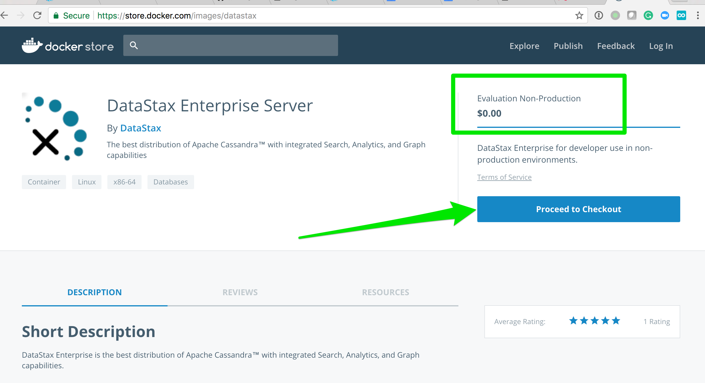
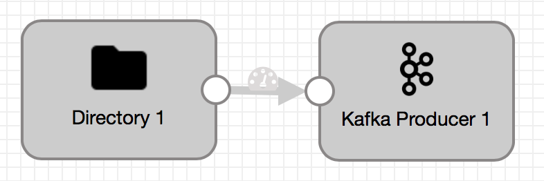
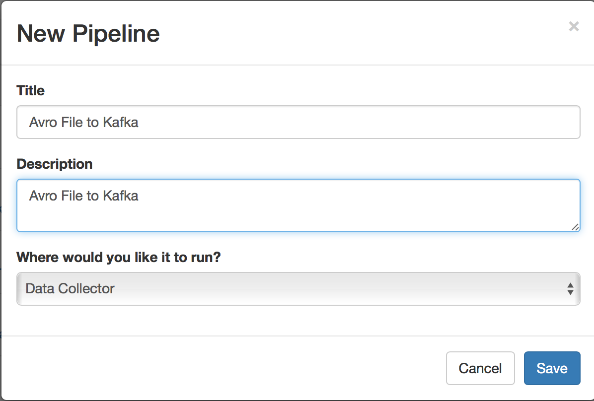
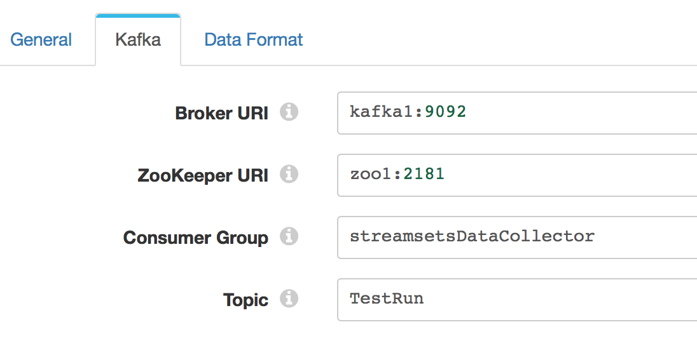

# Streaming from Kafka to DataStax with StreamSets
Provides a quick-start example of streaming data from Kafka to DataStax Enterprise (DSE) with StreamSets.


## Overview
In this tutorial, the StreamSets Data Collector is used to create streaming data pipelines to write to/from Kafka and ultimately landing in DSE.  The high-level architecture is shown in the following diagram:


## Requirements

1. Docker engine
2. Docker Store login https://store.docker.com/
3. In order to use DataStax Docker images, you need to complete a checkout form on the Docker Store.  The checkout is free and is required to associate your Docker Store login to permission to download the DataStax Enterprise Server container.

To checkout
  * Goto https://store.docker.com/images/datastax
  * Click `Proceed to Checkout` as shown



And complete the form.

## Getting Started
1. Open terminal and login to docker; i.e. `docker login`
2. Pull this github repo into `datastaxStreamsetsDocker` directory  
    ```bash
    git clone https://github.com/jphaugla/datastaxStreamsetsDocker.git
    ```
3. `cd datastaxStreamsetsDocker`
4. Start docker containers with `docker-compose up -d`
5. Wait 1 minute for containers to startup
5. Verify DataStax is up-and-running (again, see previous step, this may take a minute or two for Docker images):
```bash
docker exec dse cqlsh -u cassandra -p cassandra -e "desc keyspaces";
```
6. Create keyspace and table in DSE:
```bash
docker cp src/create_table.cql dse:/opt/dse;
docker exec dse cqlsh -f /opt/dse/create_table.cql
```
7. Verify table exists:
```bash
docker exec dse cqlsh -e "desc avro.cctest"
```
8. Create the directory and add the avro source file to the StreamSets Data Collector
```bash
docker cp src/data/ccsample streamdc:/home/sdc/tutorial/origin2;
```


## StreamSets Pipelines

As an alternative to creating these pipelines, the pipelines are exported in the exports directory.  

StreamSets pipeline documentation can be found here:

[https://streamsets.com/documentation/datacollector/latest/help/index.html#datacollector/UserGuide/Pipeline_Design/What_isa_Pipeline.html](https://streamsets.com/documentation/datacollector/latest/help/index.html#datacollector/UserGuide/Pipeline_Design/What_isa_Pipeline.html)

A pipeline describes the flow of data from the origin system to destination systems and defines how to transform the data along the way.

We will have a pipeline to pull data from an avro file and add it to kafka.  Then, a second pipeline will pull data from kafka and write to DataStax Cassandra

## Open up the StreamSets Data Collector Interface

* Bring up the StreamSets Data Collector from the browser with localhost:18630 using *admin* as both the username and the password

## Add Additional Libraries to Stage Libraries section

The package manager makes stage libraries available to pipelines.  The following three stage libraries need to be added for the subsequent pipelines.

1. Click on *Package Manager* icon 
2. Select Apache Kafka version (0.10.0.0 for example)
3. click the ellipsis buttons and select install
4. click *Restart Data Collector*
5. log back in to StreamSets Data collector
6. Select latest *Jython* and install, restart, login
7. Select latest *Cassandra Java Driver* and install, restart, login

## Create Kafka producer pipeline

When completed, the pipeline will look like this:


### Creating a Pipeline

* Create a new Pipeline by clicking the **Create New Pipeline** button to bring up the New Pipeline dialog box.  Enter a Title and Description for the Pipeline and click **Save**.

### Defining the Source
* Drag the **Directory** origin stage into your canvas.
* In the Configuration settings below, select the *Files* tab.
* Enter the following settings:

 * **Files Directory** - The absolute file path to the directory containing the sample .avro files.
 * **File Name Pattern** - `cc*` -
 *The ccdata file in the samples directory is a bzip2 compressed Avro file.*  Data Collector will automatically detect and decrypt it on the fly.

In the data format tab, choose Avro.

* In the *Post Processing* tab make sure **File Post Processing** is set to None.

*Note: The Avro files already contain the schema that the origin will pick up and decode on the fly. If you'd like to override the default schema, enter the custom schema in the Avro tab.*


### Defining the Kafka Producer

1. Drag a **Kafka** Producer Destination to the canvas and connect the Directory to the Kafka Producer
2. Click on the Kafka Producer.  
3. Go to the Kafka tab and set the Broker URI property to point to your Kafka broker e.g.`kafka1:9092`. Set Topic to the name of your Kafka topic (TestRun). And set Data Format to SDC Record.

4. In the *Data Format* tab, choose SDC Record
*SDC Record is the internal data format that is highly optimized for use within StreamSets Data Collector (SDC). Since we are going to be using another Data Collector pipeline to read from this Kafka topic we can use SDC Record to optimize performance. If you have a custom Kafka Consumer on the other side you may want to use one of the other data formats and decode it accordingly.*
5. Click on the pipeline canvas, got to the *Error Records* tab, choose to discard the error messages

The pipeline is now ready to feed messages into Kafka.

#### Preview the Data
* Feel free to hit the Preview icon to examine the data before executing the pipeline.

#### Execute the Pipeline
* Hit the Start icon. If your Kafka server is up and running, the pipeline should start sending data to Kafka.  Watching the metrics, 10,000 rows should go to the producer.  Stop the Pipelin using the red stop rectangle.  To rerun at a later time, make sure to *reset origin* (under the ellipsis) to restart the load from the beginning.

## Create Kafka Consumer

Once stage properties are added, the pipeline will look like this:


1.  Create another New Pipeline *Kafka to Cassandra*
2.  Add the **Kafka** consumer origin to the canvas
3.  Provide the following information under the **Kafka** tab of the **Kafka** origin.

Choose SDC Record under the Data Format tab
4. Add the *Processor* called *Field Type Converter* to the Pipeline and connect it to the Kafka Consumer
5. For the Field Type Conversion, add the following conversion type information
6. Add the *Processor* called *Jython Evaluator* and connect it to the *Field Type Converter*
7. In the *jython* tab of the *Jython Evaluator*, enter the following code
```python

for record in records:
  try:
    cc = record.value['card_number']
    if cc == '':
      error.write(record, "Credit Card Number was null")
      continue

    cc_type = ''
    if cc.startswith('4'):
      cc_type = 'Visa'
    elif cc.startswith(('51','52','53','54','55')):
      cc_type = 'MasterCard'
    elif cc.startswith(('34','37')):
      cc_type = 'AMEX'
    elif cc.startswith(('300','301','302','303','304','305','36','38')):
      cc_type = 'Diners Club'
    elif cc.startswith(('6011','65')):
      cc_type = 'Discover'
    elif cc.startswith(('2131','1800','35')):
      cc_type = 'JCB'
    else:
      cc_type = 'Other'

    record.value['credit_card_type'] = cc_type
    output.write(record)

  except Exception as e:
    # Send record to error
    error.write(record, str(e))
```
8. Add the *Destination* called *Cassandra Java Driver* and connect it to the *Field Type Converter*
9. Add the following **Required Fields** in the Cassandra Destination General Tab (without this step the pipeline will not populate Cassandra)

6. In the Cassandra Destination **Cassandra** Tab:  
  * Add **dse** as the contact point
  * V4 as the protocol version

5. Click on the pipeline canvas, got to the *Error Records* tab, choose to discard the error messages
7. Start both of the pipleines (start *Kafka to Cassandra* before starting *Avro to Cassandra*).  If records don't flow, try stopping, resetting the origin, and starting the *Avro to Kafka* pipeline while leaving the *Kafka to Cassandra* pipeline running
8. Ensure Data flowed into the cassandra table
```bash
docker exec dse cqlsh -e "select * from avro.cctest"
```
## Completed!


## Further Reference

* DataStax Docker Images
[https://github.com/datastax/docker-images/#datastax-platform-overview](https://github.com/datastax/docker-images/#datastax-platform-overview).

* [StreamSets](https://www.streamsets.com)

* Test data came from a StreamSets tutorial github but I have copied the data into this github.
 [https://github.com/streamsets/tutorials/blob/master/sample_data/](https://github.com/streamsets/tutorials/blob/master/sample_data/)
